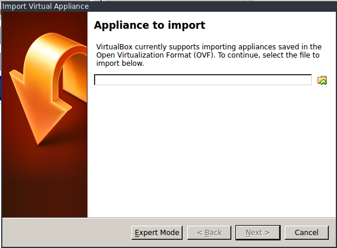
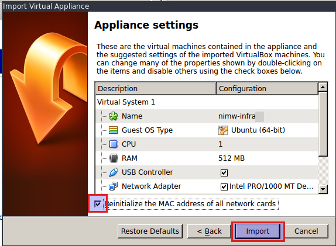
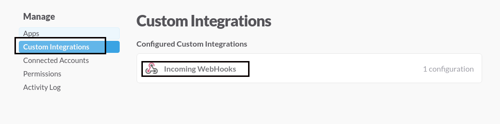
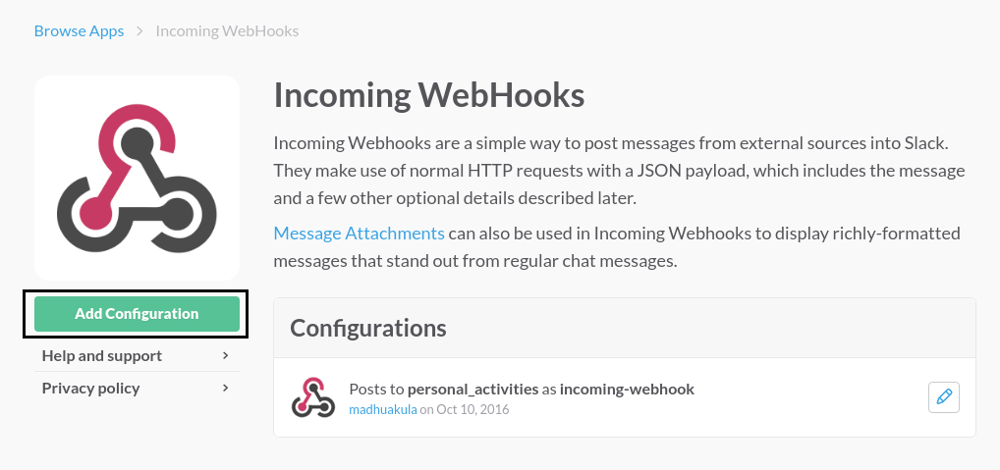
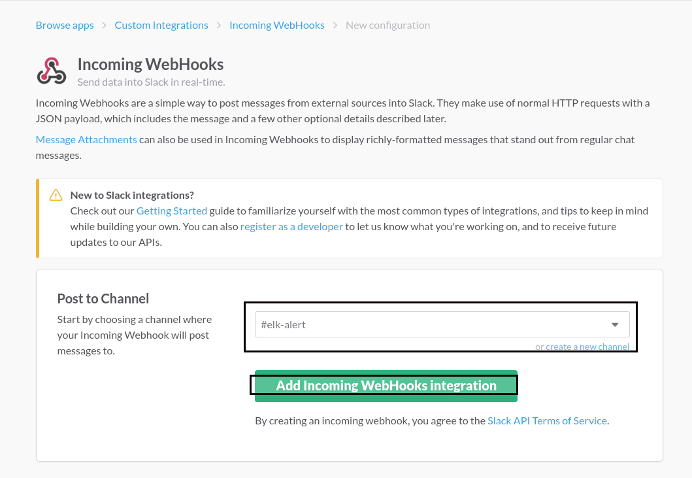
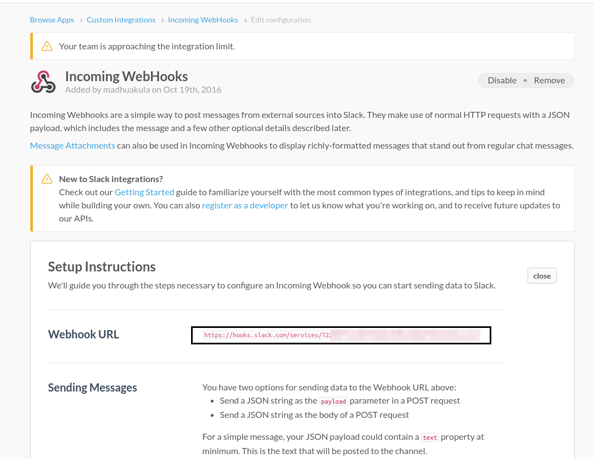
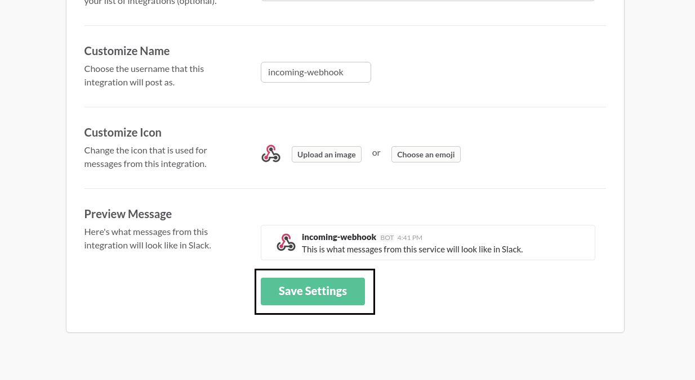

## Automated Infrastructure Security Monitoring & Defence

#### **Madhu Akula**

null Bangalore Bachaav, 10th December 2016


---

## Hello everyone :)
#### Welcome to awesome workshop!

----

## SCHEDULE

**Saturday, 10th December 2016**<br />
**09:30 – 18:00**
<br /><br />

There will be
- 20 minute break at 11:30
- 1 hour break at 13:00
- 20 minute break at 16:00

---

### Pre-requisites
- This workshop is intended for beginner to mid-level, we are expecting that participants are comfortable with basic Linux CLI usage
- Laptop with administrative privileges (to install VirtualBox)
- VirtualBox 5 (or) above
- Python 2.7.x
- 10GB hard disk space for virtual machines
- Minimum 4 GB RAM
- Enthusiasm to learn cool stuff :)

----

## Instructions
1. Please follow the commands and the overall flow as given in the slides
2. Please direct all questions/queries to instructors (or) volunteers

---

## What will you learn today?
- Infrastructure monitoring by aggregating and analysing logs
- Centralised logging using the ELK stack in near real-time
- Creating attack pattern dashboards for Alerting & Monitoring
- Exporting and Importing dashboards for reporting and reuse
- Advanced configurations of the ELK stack
- Automated Defence with collected data

----

## (Bonus)
**Best practices and Security Tips**

---

## What we are not covering
- Performance tuning and optimisation for clusters
- Multi cluster configurations
- Custom plugins and scripts for Logstash

Note: Time constraint + Internet access + Resource constraints

---

### So what is Automated Infrastructure Security Monitoring & Defence?

----

### What is monitoring?


Note: observe an event and check the progress over a period of time.

----

### What is this 'infrastructure' we keep talking about?
>

Note: All your assets in an enterprisey environment. The routers, firewalls, web app servers, linux boxes, ldap servers, database servers etc.


---

## About Me

----

### Madhu Akula

- Automation Ninja @Appsecco
- Security, Cloud & DevOps lover
- Trainer & Speaker [Defcon, DevSecCon, DevOps Days IN, All Day DevOps, etc.]
- Acknowledged by more than 200 giant companies like Google, Microsoft, Yahoo, Adobe, etc for finding security vulnerabilities
- Open source contributor
- Never ending learner!
- Twitter: [@madhuakula](https://twitter.com/@madhuakula)


----

### About Appsecco
Enable companies to design, specify, develop and purchase software that is secure

Work with companies to test existing software they have for security issues and give them the information they need to fix any problems we find

Ensure that companies can recover from security incidents they suffer and work with them to stop them from reoccurring

---

### Quick look at the basics of "centralised" logging

---

## What are logs?

- A log (file) is a collection of records or events
- Logs used to be a (often indecipherable) line of text intended for offline human analysis of what went wrong
- Logs are a critical part of any system giving you an insight into the working of a system

----

## Why is it boring to work with logs?
- Can be pretty large
- Correlation can be painful
- Others?

----

## What is centralised logging?

- Managing logs and accessing them can get complicated with multiple hosts
- Searching for a particular error across hundreds of log files on hundreds of servers is difficult without good tools
- A common approach to this problem is to setup a centralised logging solution so that multiple logs can be aggregated in a central location


----

### How is it different from traditional logging?
- Logs are collected at a central server
- Parsing becomes simpler since data is accessible at a single location
- A common issue across multiple hosts/services can be identified by correlating specific time frames

----

### What are the problems of traditional logging?

----

#### No Consistency
(it’s difficult to be jack-of-all trades)

- Difficulty in logging for each application, system, device
- Interpreting various type of logs
- Variation in format makes it challenging to search
- Many types of time formats

----

#### No Centralisation
(simply put, log data is everywhere)

- Logs in many locations on various servers
- SSH + GREP don’t scale

----

#### Accessibility of Log Data
(much of the data is difficult to locate and manage)

- Access is often difficult
- High expertise to mine data
- Logs can be difficult to find
- Immense size of Log Data

---

## The ELK stack

----

### Elasticsearch, Logstash and Kibana
Different open source modules working together

----

- Helps users/admins to collect, analyse and visualise data in (near) real-time
- Each module fits based on your use case and environment

----

### Components of the stack

- Elasticsearch
- Logstash
- Kibana
- (Beats)

---

##
<small>Ref: https://www.elastic.co/products</small>

----

## Elasticsearch
- Distributed and Highly available search engine, written in Java and uses Groovy
- Built on top of Lucene
- Multi Tenant with Multi types and a set of APIs
- Document Oriented providing (near) real time search

---

## 
<small>Ref: https://www.elastic.co/products</small>

----

## Logstash
- Tool for managing events and logs written in Ruby
- Centralised data processing of all types of logs
- Consists of 3 main components
    + Input : Passing logs to process them into machine understandable format
    + Filter : Set of conditions to perform specific action on a event
    + Output : Decision maker for processed events/logs

---

## 
<small>Ref: https://www.elastic.co/products</small>

----

### Kibana
- Powerful front-end dashboard written in JavaScript
- Browser based analytics and search dashboard for Elasticsearch
- Flexible analytics & visualisation platform
- Provides data in the form of charts, graphs, counts, maps, etc. in real-time

---

## 
<small>Ref: https://www.elastic.co/products</small>

----

### Beats
- Lightweight shippers for Elasticsearch & Logstash
- Capture all sorts of operational data like logs or network packet data
- It can send logs to either elasticsearch, logstash

----

- Different kind of beats
    + Libbeat : The Go framework for creating new Beats
    + Packetbeat : Tap into your wire data
    + Filebeat : Lightweight log forwarder to Logstash & Elasticsearch
    + Winlogbeat : Sends windows event logs

----

#### Filebeat
- Lightweight Shipper for Log Data
- Filebeat is an opensource file harvester
- Used to fetch logs files and feed them into logstash
- It has replaced logstash-forwarder

---

## ELK overview
>
<small>Ref: https://www.elastic.co/products</small>

---

## A quick history lesson

----

### About Elastic

- `Shay Banon` created Compass in 2004, third version of Compass is the first version of Elasticsearch, released in Feb 2010
- Elasticsearch was founded in 2012, Rashid (Kibana) joined Jan 2013 and Jordan (Logstash) joined in Aug 2013. (elastic.co)
- Combined stack is now called `Elastic Stack` and `X-Pack`

---

## Terms we should be aware of in context to ELK

----

### Node

> A node is a running instance of elasticsearch which belongs to a cluster.

----

### Cluster

> Cluster is a collection of one or more nodes that together holds your entire data and provides indexing and search capabilities across all nodes.

<br />
> Nodes must have the same cluster.name to belong to the same cluster.

----

### Document

> A document is a basic unit of information that can be stored and searched.

<br />

>It refers to the top-level, or root object that is serialised into JSON and stored in Elasticsearch under a unique ID.

----

### Index

> An index is a collection of documents that have somewhat similar characteristics. It has mappings which define multiple types.

----

### Type

> Within an index, you can define one or more types. A type is a logical category/partition of your index whose semantics are completely up to you.

----

### Shard

> Elasticsearch provides the ability to subdivide an index into multiple pieces called shards since an index can store a large amount of data that can exceed the hardware limits of a single node.

<br />
> Each shard is in itself a fully-functional and independent "index" that can be hosted on any node in the cluster.

Note: For eg, a single index of a billion docs taking up 1TB of disk space may not fit on the disk of a single node or may be too slow to serve search requests from a single node alone.

When you create an index, you can simply define the number of shards that you want.

----

### Replica

>Elasticsearch allows you to make one or more copies of your index’s shards into what are called replica shards, or replicas for short.

Note: For this reason, it is important to note that a replica shard is never allocated on the same node as the original/primary shard that it was copied from
It provides high availability in case a shard/node fails. Also to scale out your search volume/throughput since searches can be executed on all replicas in parallel

---

### Snapshot and Restore

> A copy of the current state and data in a cluster that is saved to a shared repository.

> Elasticsearch provides a snapshot API to achieve this.


----

### Routing

> A mechanism in Elasticsearch that identifies which shard a particular document resides in.

----

### Near real time

> Elasticsearch is a near real time search platform.

<br />

> What this means is there is a slight latency (normally one second) from the time you index a document until the time it becomes searchable.

---

### Workshop architecture


---

# Hands-On

----

### Import virtual machine appliance

Please import the virtual machine appliance from

`null-bachaav-aismd/Virtual-Machines/NLIMW-Vanilla-Appliance.ova`


----



----



---

### Start the both virtual machines

---

### Login to the both machines

**username :: password**

infra::infra
monitor::monitor

---

# Please note

- In this entire documentation. Please change the IP address as you have got
    + `192.168.56.101` is the `monitor` VM
    + `192.168.56.100` is the `infra` VM


---

### SSH into the monitor VM

switch to `root` user by entering the below command

```
ssh -l monitor 192.168.56.101
sudo -i
```

---

### Configuration Paths in Monitor VM

**Logstash**
```
configuration = /etc/logstash/conf.d/
installation = /opt/logstash/bin/logstash
logs = /var/log/logstash
```

**elasticsearch**
```
configuration file = /etc/elasticsearch/elasticsearch.yml
installation = /usr/share/elasticsearch/bin/elasticsearch
logs = /var/log/elasticsearch
backups = /var/backups/elasticsearch
```

**Kibana**
```
configuration file = /opt/kibana/config/kibana.yml
installation = /opt/kibana/bin/kibana
logs = /var/log/kibana
```

---

### Configure Elasticsearch Cluster

- Replace the below content using your choice of text editor. `vi /etc/elasticsearch/elasticsearch.yml`

```
cluster.name: ninja-infra-mon

node.name: node-1

bootstrap.memory_lock: true

network.host: 127.0.0.1

path.repo: "/var/backups/elasticsearch"

```

Note: make sure check the spaces before editing in the file

----

- Start Elasticsearch service by running

```
service elasticsearch restart
```

---

- Check whether Elasticsearch is running or not

```
curl -XGET 'http://localhost:9200'
```


Note: It will take 3 to 5 seconds to start elasticsearch

----

- Check the Elasticsearch cluster status

```
curl -XGET 'http://localhost:9200/_cluster/health?pretty'

curl -XGET 'http://localhost:9200/_cluster/state?pretty'
```

- <font color="green">`green`</font> - All primary and replica shards are active.
- <font color="yellow">`yellow`</font> - All primary shards are active, but not all replica shards are active.
- <font color="red">`red`</font> - Not all primary shards are active.

---

## So What happens in a multi node cluster?

----

### Clustering

> Elasticsearch is built to be always available, and to scale. Scale can come from buying bigger servers (vertical scale, or scaling up) or from buying more servers (horizontal scale, or scaling out).

Note: We need to start by understanding the word 'Clustering' in context with Elasticsearch

----

### An Empty Cluster

Our cluster with a single node, with no data and no indices:


- A node is a running instance of Elasticsearch
- A Cluster consists of one or more nodes with the same cluster.name

Note:By default Elasticsearch will have 5 primary shards and 1 replica shard with cluster name `elasticsearch` and node name as a random Marvel character.

----

### Adding index

- In an empty one-node cluster, we will assign three primary shards and one replica
- There is one replica for all the primary shards


Note: Because there is no separate node, the replica shard becomes unassigned. Which is why it is not denoted in this image.

----

### Add Failover

- Running a single node means that you have a single point of failure - there is no redundancy
- We can simply start another node to prevent data loss


----

### Scale Horizontally

- One shard each from Node 1 and Node 2 have moved to the new Node 3


Note: This means that the hardware resources (CPU, RAM, I/O) of each node are being shared among fewer shards, allowing each shard to perform better

----

### Scale more

Three primaries and six replicas. This means that we can scale out to a total of nine nodes, again with one shard per node


Note: This would allow us to triple search performance compared to our original three-node cluster

----

### Failover Test

- A cluster must have a master node in order to function correctly
- When a master node dies, the nodes elect a new master


---

### Restful APIs over `HTTP` (CURL)

```
curl -X<VERB> '<SCHEMA>://<HOST>/<PATH>?<QUERY_STRING>' -d '<BODY>'
```

Note:

`VERB` - The appropriate HTTP method or verb: GET, POST, PUT, HEAD, or DELETE.<br />
`SCHEMA` - Either http or https (if you have an https proxy in front of Elasticsearch.)<br />
`HOST` - The hostname of any node in your Elasticsearch cluster, or localhost for a node on your local machine.<br />
`PORT` - The port running the Elasticsearch HTTP service, which defaults to 9200.<br />
`QUERY_STRING` - Any optional query-string parameters (for example ?pretty will pretty-print the JSON response to make it easier to read.)<br />
`BODY` - A JSON encoded request body (if the request needs one.)<br />


---

### What is CRUD?

C - Create
R - Retrieve
U - Update
D - Delete

---

### CRUD operations over Elasticsearch

----

<div align="left">Simple Index Creation with XPUT:</div>

```
curl -XPUT 'http://localhost:9200/null/'
```

<div align="left">Add data to your created index:</div>

```
curl -XPUT 'http://localhost:9200/null/workshop/1' -d '{"user":"ninja"}'
```

<div align="left">To check the Index status:</div>

```
curl -XGET 'http://localhost:9200/null/?pretty'
```

----

<div align="left">Automatic doc creation in an index with XPOST:</div>

```
curl -XPOST 'http://localhost:9200/null/workshop/' -d '{"user":"ninja"}'
```

<div align="left">Creating a user profile doc:</div>

```
curl -XPUT 'http://localhost:9200/null/workshop/9' -d '{"user":"admin", "role":"tester", "job":"engineer"}'
```

<div align="left">Update the document:</div>

```
curl -XPOST 'http://localhost:9200/null/workshop/9' -d '{"user":"administrator", "role":"tester", "job":"engineer"}'
```

----

<div align="left">Searching a doc in an index. Create 2 docs:</div>

```
curl -XPOST 'http://localhost:9200/null/workshop/' -d '{"user":"abcd", "role":"tester", "job":"engineer"}'
```

```
curl -XPOST 'http://localhost:9200/null/workshop/' -d '{"user":"abcd", "role":"admin", "job":"engineer"}'
```

<div align="left">Then search:</div>

```
curl -XGET 'http://localhost:9200/null/_search?q=user:abcd&pretty'
```


<div align="left">Deleting a doc in an index:</div>

```
curl -XDELETE 'http://localhost:9200/null/workshop/1'
```

---

### Setting up nginx reverse-proxy for elasticsearch and kibana

- Generate the basic authentication password by running `htpasswd`

```
htpasswd -c /etc/nginx/htpasswd.users elkadmin
```

```
Password : Null@123
Confirm Password : Null@123
```


---

- Replace the nginx default configuration by editing  `vi /etc/nginx/sites-available/default`

```
server {
    listen 80; #for Kibana

    server_name localhost;

    auth_basic "Restricted Access";
    auth_basic_user_file /etc/nginx/htpasswd.users;

    location / {
        proxy_pass http://localhost:5601;
        proxy_http_version 1.1;
        proxy_set_header Upgrade $http_upgrade;
        proxy_set_header Connection 'upgrade';
        proxy_set_header Host $host;
        proxy_cache_bypass $http_upgrade;
    }
}

server {
    listen 8080; #for Elasticsearch

    server_name localhost;

    auth_basic "Restricted Access";
    auth_basic_user_file /etc/nginx/htpasswd.users;

    location / {
        proxy_pass http://localhost:9200;
        proxy_http_version 1.1;
        proxy_set_header Upgrade $http_upgrade;
        proxy_set_header Connection 'upgrade';
        proxy_set_header Host $host;
        proxy_cache_bypass $http_upgrade;
    }
}
```

- Restart the `nginx` service to apply the changes

```
service nginx restart
```

---

### Elasticsearch plugins overview

Plugins already installed in the system

----

Navigate to http://192.168.56.101:8080/_plugin/head

- Use the username `elkadmin` and password `Null@123`


---


Note: Please use your monitor VM IP

---


---


----

Navigate to http://192.168.56.100:8080/_plugin/hq


Note: Please use your monitor VM IP

---

### Let's configure Logstash


----

### Logstash components

Logstash consists of 3 main components

- Input: Passing logs to process them into machine understandable format
- Filters: Set of conditionals to perform specific action on a event
- Output: Decision maker for processed events/logs

----

### Basic Logstash configuration

```
input {
    stdin {}
    file {}
    ...
}

filter {
    grok {}
    date {}
    geoip {}
    ...
}

output {
   elasticsearch {}
   email {}
   ...
}
```

----

#### Input

> An input plugin enables a specific source of events to be read by Logstash.

- File
- Lumberjack
- S3
- Beats
- Stdin
- Many more.
[https://www.elastic.co/guide/en/logstash/current/input-plugins.html](https://www.elastic.co/guide/en/logstash/current/input-plugins.html)

----

#### Filter

> A filter plugin performs intermediary processing on an event. Filters are often applied conditionally depending on the characteristics of the event.

- CSV
- GeoIP
- Mutate
- Grok
- Many More.
[https://www.elastic.co/guide/en/logstash/current/filter-plugins.html](https://www.elastic.co/guide/en/logstash/current/filter-plugins.html)

----

#### Output

> An output plugin sends event data to a particular destination. Outputs are the final stage in the event pipeline.

- Elasticsearch
- Email
- Stdout
- S3, file
- HTTP
- Many More.
[https://www.elastic.co/guide/en/logstash/current/output-plugins.html](https://www.elastic.co/guide/en/logstash/current/output-plugins.html)

---

### Basic logstash pipeline

<div align="left">A quick test to check your logstash installation:</div>

```
/opt/logstash/bin/logstash -e 'input { stdin {} } output { stdout {} }'
```

Note: Logstash will take 3 to 5 seconds to start and type some text in the terminal to get it as output (stdin -> stdout)

---

### A quick primer on Grok filters

----

- The syntax for a grok pattern is `%{SYNTAX:SEMANTIC}`
- `SYNTAX` is the name of the pattern that will match your text.
    - For example: `1337` will be matched by the `NUMBER` pattern, `192.168.123.12` will be matched by the `IP` pattern.
- SEMANTIC is the identifier you give to the piece of text being matched.
E.g. `1337` could be the count and `192.168.123.12` could be a `client` making a request

```
%{NUMBER:count}
%{IP:client}
```

Note: Grok is based on pre created regex patterns

----

### Example grok

<div align="left">For the following log event:</div>

```
55.3.244.1 GET /index.html 15824 0.043
```

<div align="left">This would be the matching grok:</div>

```
%{IP:client} %{WORD:method} %{URIPATHPARAM:request} %{NUMBER:bytes} %{NUMBER:duration}
```


----

#### Consider the following Apache Log Event

```
123.249.19.22 - - [01/Feb/2015:14:12:13 +0000] "GET /manager/html HTTP/1.1" 404 448 "-" "Mozilla/3.0 (compatible; Indy Library)
```


----

Using a regular expression!!


----

Using Grok filter patterns :)

```
%{IPV4} %{USER:ident} %{USER:auth} \[%{HTTPDATE:timestamp}\] "(?:%{WORD:verb} %{NOTSPACE:request}(?: HTTP/%{NUMBER:httpversion})?)" %{NUMBER:response} (?:%{NUMBER:bytes}|-)
```

----

Things can get even more simpler using an *inbuilt* grok :) :)

```
%{COMBINEDAPACHELOG}
```

----

### Available Logstash Grok Patterns
- [https://grokdebug.herokuapp.com/patterns](https://grokdebug.herokuapp.com/patterns)
- [http://grokconstructor.appspot.com/](http://grokconstructor.appspot.com/)
- [https://github.com/logstash-plugins/logstash-patterns-core/blob/master/patterns/grok-patterns](https://github.com/logstash-plugins/logstash-patterns-core/blob/master/patterns/grok-patterns)
- [https://github.com/clay584/logstash_configs](https://github.com/clay584/logstash_configs)

---

### Create a logstash configuration to receive filebeat logs from infra VM

- Create the input file to receive logs from filebeat `vi /etc/logstash/conf.d/02-beats.conf` in the `monitor` machine

```
input {
  beats {
    port => 5044
    ssl => true
    ssl_certificate => "/etc/pki/tls/certs/logstash-forwarder.crt"
    ssl_key => "/etc/pki/tls/private/logstash-forwarder.key"
  }
}
```

----

- Create the ssh logs filter file  `vi /etc/logstash/conf.d/10-ssh-log.conf`

```
filter {
 if [type] == "sshlog" {
  grok {
#    add_tag => [ "valid" ]

    match => [
      "message", "%{SYSLOGTIMESTAMP:syslog_date} %{SYSLOGHOST:syslog_host} %{DATA:syslog_program}(?:\[%{POSINT}\])?: %{WORD:login} password for %{USERNAME:username} from %{IP:ip} %{GREEDYDATA}",
      "message", "%{SYSLOGTIMESTAMP:syslog_date} %{SYSLOGHOST:syslog_host} %{DATA:syslog_program}(?:\[%{POSINT}\])?: message repeated 2 times: \[ %{WORD:login} password for %{USERNAME:username} from %{IP:ip} %{GREEDYDATA}",
      "message", "%{SYSLOGTIMESTAMP:syslog_date} %{SYSLOGHOST:syslog_host} %{DATA:syslog_program}(?:\[%{POSINT}\])?: %{WORD:login} password for invalid user %{USERNAME:username} from %{IP:ip} %{GREEDYDATA}",
      "message", "%{SYSLOGTIMESTAMP:syslog_date} %{SYSLOGHOST:syslog_host} %{DATA:syslog_program}(?:\[%{POSINT}\])?: %{WORD:login} %{WORD:auth_method} for %{USERNAME:username} from %{IP:ip} %{GREEDYDATA}"
    ]
  }

# If we wanted to get only valid SSH logs
#  if "valid" not in [tags] {
#    drop { }
#  }

#  mutate {
#    remove_tag => [ "valid" ]
#    lowercase => [ "login" ]
#  }

  date {
    match => [ "timestamp", "dd/MMM/YYYY:HH:mm:ss Z" ]
    locale => en
  }

  geoip {
    source => "ip"
  }
 }
}
```

----

- Create the web logs filter file `vi /etc/logstash/conf.d/11-web-log.conf`

```
filter {
 if [type] == "weblog" {
  grok {
    match => {
      "message" => '%{IPORHOST:clientip} %{USER:ident} %{USER:auth} \[%{HTTPDATE:timestamp}\] "%{WORD:verb} %{DATA:request} HTTP/%{NUMBER:httpversion}" %{NUMBER:response:int} (?:-|%{NUMBER:bytes:int}) %{QS:referrer} %{QS:agent}'
    }
  }

  date {
    match => [ "timestamp", "dd/MMM/YYYY:HH:mm:ss Z" ]
    locale => en
  }

  geoip {
    source => "clientip"
  }

  useragent {
    source => "agent"
    target => "useragent"
  }
 }
}
```

----

- Create the output elasticsearch file `vi /etc/logstash/conf.d/20-elastic-output.conf`

```
output {
  elasticsearch {
    hosts => ["localhost:9200"]
    #sniffing => true
    manage_template => false
    index => "infra-%{+YYYY.MM.dd}"
  }
}
```

---

### Generate SSL Configuration for logstash to receive logs from infra VM

- Run the below commands in `monitor` machine

```
mkdir -p /etc/pki/tls/{certs,private}
```

- Add the system IP information by adding the below line `vi /etc/ssl/openssl.cnf +225`

```
subjectAltName = IP: 192.168.56.101
```

Note: (Monitor VM) ELK Server IP address

---

```
cd /etc/pki/tls
openssl req -config /etc/ssl/openssl.cnf -x509 -days 365 -batch -nodes -newkey rsa:2048 -keyout private/logstash-forwarder.key -out certs/logstash-forwarder.crt
```

---

### Start the Logstash service

```
service logstash restart
```

---

### Kibana

> Kibana is an open source analytics and visualization platform designed to work with Elasticsearch. You use Kibana to search, view, and interact with data stored in Elasticsearch indices

---

### Also start the kibana service

```
service kibana restart
```

---

### Understanding the Kibana UI

**Index Selection**


- Index for our workshop is `infra-*`

----

**Adding multiple indices**


----

**Discovery**


----

**Mapped log in JSON format**


----

**Visualize**


- Choose a new visualization to create charts, graphs, etc.

----

**Selecting the search source**


- We can select the search source to create visualization. It can be saved search or new search

----

**Creating a pie chart**


- Now we can select the aggregation, for example `count` and we can also give custom label to display
- Then create buckets splitting slices. select the field which you want to create a pie chart and select the size of the field to display.
- Once selection is done, Click on the play button to apply the changes

----

**Dashboard**


- Dashboards and visualizations can be imported and exported in JSON format

----

**Status**


----

**Import/Export**


---

### Let's configure the infra VM

----

### SSH into the infra VM

```
ssh -l infra 192.168.56.100
sudo -i
```

----

### Create filebeat configuration to send logs to the monitor VM

- Edit the configuration file by `vi /etc/filebeat/filebeat.yml`
- Note: replace the IP of the monitor VM at hosts

```
filebeat:
  prospectors:
    -
      paths:
        - /var/log/auth.log
      #  - /var/log/syslog
      #  - /var/log/*.log

      document_type: sshlog

    -
      paths:
        - /var/log/apache2/access.log

      document_type: weblog

  registry_file: /var/lib/filebeat/registry

output:
  logstash:
    hosts: ["192.168.56.101:5044"]
    bulk_max_size: 1024

    tls:
      certificate_authorities: ["/etc/pki/tls/certs/logstash-forwarder.crt"]

shipper:

logging:
  files:
    rotateeverybytes: 10485760 # = 10MB
```

Note: `hosts` IP address is (monitor VM) ELK server IP address

----

### Copy the `logstash-forwarder.crt` to infra VM from monitor VM

- scp the certificate from monitor VM to infra VM

```
mkdir -p /etc/pki/tls/certs/

cd /etc/pki/tls/certs/

scp monitor@192.168.56.101:/etc/pki/tls/certs/logstash-forwarder.crt /etc/pki/tls/certs/logstash-forwarder.crt
```

----

### Restart the filebeat service


```
service filebeat restart
```

----

### Generate the SSH attack traffic by running bruteforce script

- In the host machine run the below script

```
python SSHBruteForce.py -i 192.168.56.100 -p 22 -d True -U ./usernames.txt -P ./passwords.txt
```

----

### Generate the WEB attack traffic by running nikto scan

- In the host machine run the below command

```
Windows: nikto.bat -config nikto.conf -host http://192.168.56.100
Linux/Mac: perl nikto.pl -config nikto.conf -host http://192.168.56.100
```

----


### Login to the elasticsearch head plugin to see the logs

- Navigate to the below URL to see that logs coming from infra VM

```
http://192.168.56.101:8080/_plugin/head
```

----


----


----

### Opening Index in Kibana

- Use the username `elkadmin` and password `Null@123`


----

### Create the filebeat index

- We have use `infra-*` as index name


----


----


---

### What is alerting for ELK stack?

> We can set up a notification system to let users/admins know that a pattern match has occurred.

----

### How is this achieved?

- Logstash output plugin alerting via (Email, Pager duty, JIRA, etc.)
- Elasticsearch commercial product - Watcher
- An open source alerting for elasticsearch by Yelp called `elastalert`
- Custom scripts

---

### Introducing elastalert

An opensource project by Yelp for alerting on Elasticsearch

> ElastAlert is a simple framework for alerting on anomalies, spikes, or other patterns of interest from data in Elasticsearch.

---

### Creating alerting for the attacks

- The elastalert is installed in `/opt/elastalert`
- Run the below commands to create elastalert index

```
elastalert-create-index
```


---

### Creating rules for attacks

---

### Web 404 error logs attack rule

- `vi /opt/elastalert/web-404-error-slack.yml`

```
es_host: localhost
es_port: 9200
name: "web 404 error log alert"
type: frequency
index: infra-*
num_events: 20
timeframe:
  hours: 24

# For more info: http://www.elasticsearch.org/guide/en/elasticsearch/reference/current/query-dsl.html

filter:
- query:
    query_string:
      query: "response: 404"

alert:
  - slack
  - email

slack:
slack_webhook_url: "https://hooks.slack.com/services/xxxxx"

email:
  - "root"

realert:
  minutes: 0
```

Note: Replace the Slack webhook

---

### Create slack webhook


----



----



----



----



----



---

### Configuring the elastalert

- Replace the configuration file content `vi /opt/elastalert/config.yaml`

```
rules_folder: example_rules
run_every:
  minutes: 1
buffer_time:
  minutes: 15
es_host: localhost
es_port: 9200
writeback_index: elastalert_status
alert_time_limit:
  days: 2
```

---

### Running alerting on indices

```
elastalert --verbose --config /opt/elastalert/config.yaml --start 2016-10-10 --rule /opt/elastalert/web-404-error-slack.yml
```

---

### Check the slack channel


---

### Check Email as well (Base64 Encoded)


---

### Backing up Elasticsearch

---

### What is Curator ?

> Elasticsearch Curator helps you curate or manage your indices.
> Supports a variety of actions from delete a snapshot to shard allocation routing.

<br />

> This is an additional software bundle that you install on top of Elasticsearch.

----

- Run the below command in monitor VM to setup the backups path

```
curl -XPUT 'http://localhost:9200/_snapshot/backup' -d '{
"type": "fs",
"settings": {
"location": "/var/backups/elasticsearch/",
"compress": true
}
}'
```

----

### To snapshot an index called `elastalert_status` into a repository `backup`

```
curator snapshot --name=elastalert_logs_snapshot --repository backup indices --prefix elastalert_status
```

### To see all snapshots in the `backup` repository

```
curator show snapshots --repository backup
```

### To restore a snapshot from curator

```
curl -XPOST 'http://localhost:9200/_snapshot/backup/elastalert_logs_snapshot/_restore'
```

---

### Restore sample logs to create some advanced dashboards

```
tar -xvf /srv/filebeat.tar.gz -C /var/backups/elasticsearch/

curator show snapshots --repository backup

curl -XPOST 'http://localhost:9200/_snapshot/backup/filebeat_logs_snapshot/_restore'
```

----

### Look at head plugin to see the restored sample logs

- Navigate to http://192.168.56.101:8080/_plugin/head


---


## Dashboards for Attack Patterns

Note: We have already imported logs to Elasticsearch using curator. <br />
Now create some advanced dashboards for attack patterns using Kibana

----


---

### Refresh the Fielbeat index field list


---

- Select the JSON file in your USB drive `/dashboards/all-kibana.json`


---

### Pre-created dashboards

- Access the pre-created dashboards using


----

### Web Attack Dashboard


----

### SSH Attack Dashboard


----

### Combined Attack Dashboard


---

### Defence (ELK + AWS Lambda) - DEMO

<iframe frameborder=0 width=95% height=586 marginheight=0 marginwidth=0 scrolling=no src="https://youtube.com/embed/3_HIlDm3GtM?autoplay=0&controls=0&showinfo=0&autohide=1"></iframe>

----

### Slides

https://speakerdeck.com/madhuakula/all-day-devops-automated-infrastructure-security-monitoring-and-defence-elk-plus-aws-lambda

---

## Ansible Playbook for the entire setup

---

## What is Ansible?

>  Simple IT automation engine that automates cloud provisioning, configuration management, application deployment, intra-service orchestration, and many other IT needs.

----

## What is an Ansible playbook?

> playbooks are Ansible's configuration, deployment, and orchestration language (written in YAML). They can describe a policy that you want your remote systems to enforce, or a set of steps in a general IT process.

----

## A playbook for our setup

> We created a plug and play ansible playbook, which helps to build and reproduce the same environment within minutes by provisioning in any cloud and stack.

---

# Pentesting the infrastructure
(what does an attacker see?)

---

## The Why?
A penetration testing exercise was undertaken to check if there was a possibility of gaining unauthorized access to the setup

---

## Black Box Penetration Testing

----

### Port scanning


----

### Service enumeration


----

### HTTP basic Auth on ports 80 and 8080


----

### Attempted brute force
Multiple dictionaries were tried against the HTTP Basic Auth


----

### Attempted brute force
Multiple dictionaries were tried against SSH as well


---

## Grey Box Penetration Testing
App credentials were provided

----

### Verbose Errors


----

### Credential Leakage through MiTM


----


----

Drop us a note if you want the complete pentest report<br />
contact@appsecco.com

---

## ELK - Exercise with network logs

---

## Stack Flow

#### CSV firewall log(network.log) -> logstash(network.conf) -> elasticsearch -> kibana(kibana-network.json)

----

- `network.log` file is at `/srv/network.log`
- `network.conf` file is in your host system configurations `network.conf` for logstash configuration
- Build your own dashboard using the log data
- We created one. If you want to use, import the `/dashboards/kibana-network.json`
- Happy ELK!

---

### Network Security Monitoring


---

### Password Dump Analysis


> ELK can also be used to do other amazing things like correlate password dumps for example and give a visual statistical model of the data contained in the dump.

---

### Alternatives to the components

Given the large environment of available tools to standardise and correlate logs, we can often create a setup using other components that talk to each other.

- [fluentd](http://www.fluentd.org/) is an alternative for logstash
- [Grafana](http://grafana.org/) is an alternative for Kibana
- [Druid](http://druid.io/) is a high-performance, column-oriented, distributed data store as an alternative Elasticsearch
- [Riemann](http://riemann.io/) aggregates events from servers and applications with a powerful stream processing language.

----

### Full stack alternatives

- [TICK Stack](https://www.influxdata.com/get-started/what-is-the-tick-stack/)
- [Graylog](https://www.graylog.org/)

many more.

---

### General Best Practice

---

### Elasticsearch Best Practice
- set `$ES_HEAP_SIZE` env var to 1/2 of RAM (but < 32GB)
- Disable memory swapping by enabling `bootstrap.mlockall`
- Set user's file `ulimit` to `unlimited` (Need reboot to check)
    - You can check with an API call as well `/_nodes/process`
- Use the default configuration and make small changes as required
- Multicast is great, but when you are going to production make sure to use `Unicast` discovery mode

----

- To eliminate the "Split-brain" problem use 3 lower resource master-eligible nodes in larger cluster environments (dedicated)
- You don't need beefy machines, simple machines are ok due to the distributed nature of elasticsearch
- Add lightweight client nodes (no data)
- Use Snapshot and Restore. This is very useful (but different from `replication`)

---

### Logstash Best Practice

- Watch out for Grok Filter data (GREEDYDATA) as they use a lot of resources especially CPU and Memory. Try to get as specific as possible
- Test your configuration with `-e` `input{...}... output{...}`
- Use `-b` flag to send bulk requests to elasticsearch
- Use `-w` flag to utilise multiple cores. This is especially useful for multi core and bulk processing

----

- Use the generator input for benchmarking (https://github.com/matejzero/logstash-benchmark) and to understand performance and optimisation metrics
- If something goes wrong try `-- debug` for more detailed output (don't forgot to turn this off when you are done)

---

### Kibana Best Practice

- Tune Queries in elasticsearch for maximum performance
- Configuring number of threads in pool
- Save and Export dashboards as a JSON File for reuse
- Deploy a proxy so that you can do basic authentication and other load balancing services
- While Kibana is an exploration tool, make sure you watch out for over-eager users affecting performance

---

### Production

- Access Control / Security
    - use nginx/apache to setup basic authentication
    - You can block `POST` /  `PUT` / `DELETE` operations
    - Disable Scripting (Version < 1.2)
    `script.disable_dynamic: true`
    - Disable destructive actions
    `action.destructive_requires_name: true`
    - Use aliases to allow users access to subsets of indices

----

- VM vs Metal
    - VM's are convenient (Auto scaling, no management, etc)
    - Bare metal is generally more configurable and higher in performance
    - Metal can utilize SSD's
    - Cloud VM's can suffer from `noisy neighbors`
    - But you should start using what you're most familiar with!

----

- Disks
    - Spinning disk's are cheaper per GB
    - SSDs have better IOPS
    - SSDs are cheaper wrt: IOPS
    - SSD manufacturing tolerance can vary (vendor based)
    - SAN / NAS can work, if IOPS are sufficient (throughput, iops, etc)
    - Don't necessarily need RAID, ES handles redundancy
        - But striping can help with performance
        - You can use shards and replicas in ES

---

### Security

- Harden the base server with traditional security techniques
- Use SSH key for login
- Remove root login
- Use randomly generated passwords
```
openssl rand -base64 24
```

----

- Enable the host firewall and allow only connections from specific IPs
- Use SSL certificates and enable HTTPS for Elasticsearch, Logstash & Kibana (E.g.: Lets encrypt)
- Use search guard for granular permissions and role based authentication for ELK (Shield is an alternative)

---

### Monitoring Services

- Enable service level monitoring for Elasticsearch, Logstash and Kibana
- Use monit (or) uptime robot for monitoring services (you can also use Icinga)

---

## Thank You for attending

###@madhuakula


